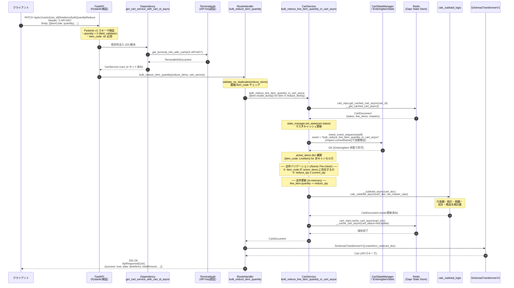
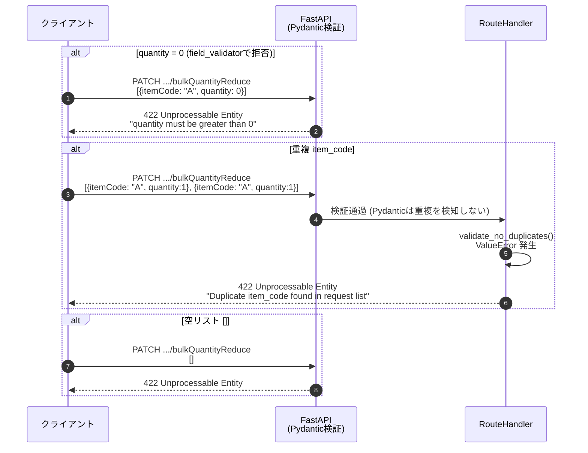
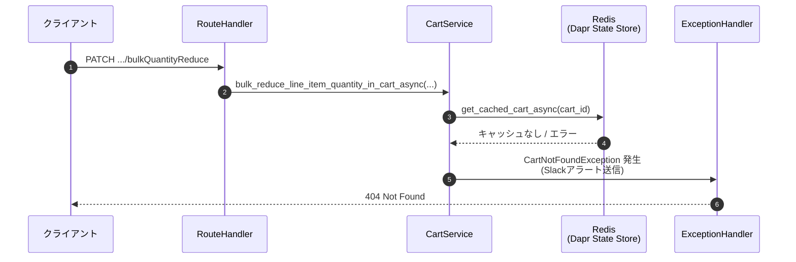
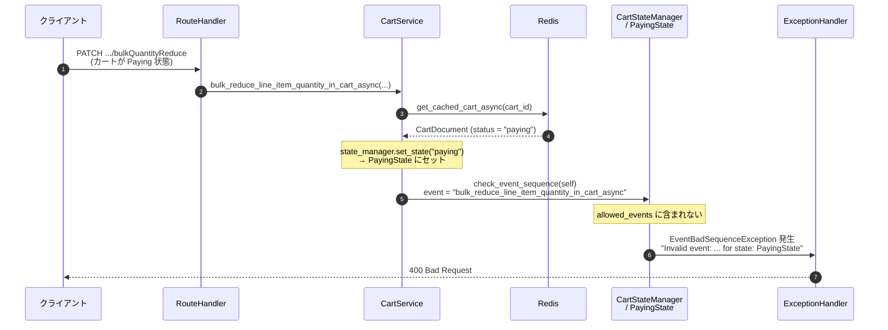
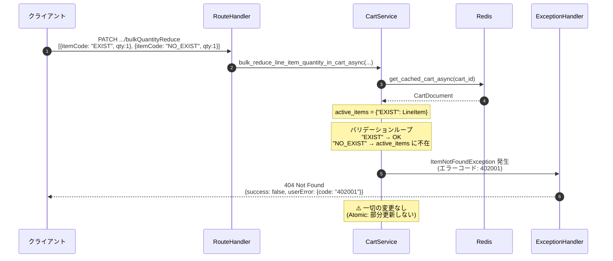
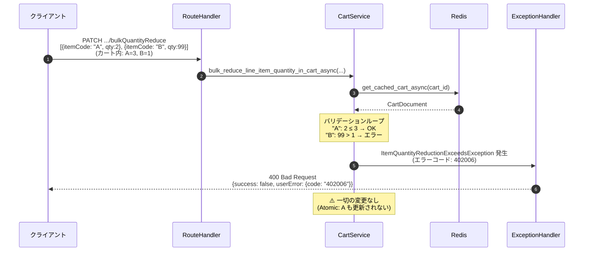

# イベントシーケンス図: 複数商品の一括数量削減API

## 1. 正常系フロー (200 OK)



---

## 2. エラー系フロー

### 2-1. リクエストバリデーションエラー (422)



### 2-2. カート未検出エラー (404)



### 2-3. ステート不正エラー (400) — Paying状態など



### 2-4. 商品未登録エラー (404)



### 2-5. 削減数量超過エラー (400)



---

## 3. コンポーネント関係図

```mermaid
graph TB
    subgraph API Layer
        RT[PATCH /carts/{cart_id}/lineItems/bulkQuantityReduce<br/>bulk_reduce_item_quantity]
        SCH[BulkQuantityReductionItem<br/>Pydantic v2 Schema]
        BVAL[BaseBulkQuantityReductionRequest<br/>validate_no_duplicates]
    end

    subgraph Service Layer
        SVC[CartService<br/>bulk_reduce_line_item_quantity_in_cart_async]
        SM[CartStateManager<br/>check_event_sequence]
        EIS[EnteringItemState<br/>allowed_events]
        SUB[calc_subtotal_logic<br/>calc_subtotal_async]
    end

    subgraph Infrastructure
        REPO[CartRepository<br/>get_cached_cart_async<br/>cache_cart_async]
        REDIS[(Redis<br/>Dapr State Store)]
    end

    subgraph Exceptions
        INF[ItemNotFoundException<br/>402001 / HTTP 404]
        EXC[ItemQuantityReductionExceedsException<br/>402006 / HTTP 400]
        EVT[EventBadSequenceException<br/>HTTP 400]
    end

    RT -->|list[BulkQuantityReductionItem]| SCH
    RT -->|validate_no_duplicates| BVAL
    RT -->|list[dict]| SVC

    SVC -->|check_event_sequence| SM
    SM -->|delegates| EIS
    SVC -->|__subtotal_async| SUB
    SVC -->|__get_cached_cart_async| REPO
    SVC -->|__cache_cart_async| REPO
    REPO <-->|Dapr State API| REDIS

    SVC -.->|item not found| INF
    SVC -.->|qty exceeds| EXC
    EIS -.->|bad sequence| EVT
```

---

## 4. Atomicity (アトミック性) の保証

```
PATCH request received
        │
        ▼
┌───────────────────────────────────────────────────────┐
│  Phase 1: 読み取り                                      │
│  Redis から CartDocument を 1回だけ取得                   │
└───────────────────────────────────────────────────────┘
        │
        ▼
┌───────────────────────────────────────────────────────┐
│  Phase 2: 全件バリデーション (変更なし)                     │
│  for each item in reduce_items:                        │
│    ① item_code が存在するか？  → No: 404 で即時中断        │
│    ② reduce_qty ≤ current_qty？→ No: 400 で即時中断        │
└───────────────────────────────────────────────────────┘
        │  全件 OK の場合のみ
        ▼
┌───────────────────────────────────────────────────────┐
│  Phase 3: 全件更新 (in-memory)                          │
│  for each item in reduce_items:                        │
│    line_item.quantity -= reduce_qty                    │
└───────────────────────────────────────────────────────┘
        │
        ▼
┌───────────────────────────────────────────────────────┐
│  Phase 4: 小計再計算                                     │
│  calc_subtotal_async() 1回呼び出し                       │
└───────────────────────────────────────────────────────┘
        │
        ▼
┌───────────────────────────────────────────────────────┐
│  Phase 5: 書き込み                                      │
│  Redis へ CartDocument を 1回だけ保存                     │
└───────────────────────────────────────────────────────┘
        │
        ▼
   200 OK レスポンス

※ Phase 2 でエラーが発生した場合、Phase 3〜5 は実行されず
   カートは一切変更されない（部分更新なし）
```
